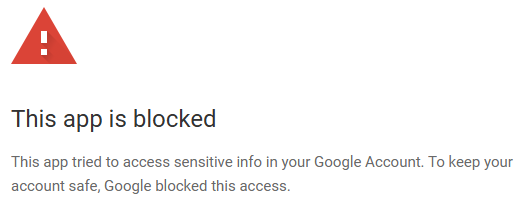

# rebalance-portfolio

Google Apps Script (GAS) code to calculate optimal purchases to re-balance a portfolio.

[Click here to create a copy of the demo Google Sheet (the required GAS code will also be copied)](https://docs.google.com/spreadsheets/d/1ntywtnbHjnhOAXBWm3uxT4xhSpne-s9qYo59h99WP40/copy).

Uses [LinearOptimizationService](https://developers.google.com/apps-script/reference/optimization/linear-optimization-service) for the calculation:

Constraints:
- 0 <= remaining cash <= 10
- Optimal purchase - maximum deviation* <= Delta <= optimal purchase + maximum deviation*

Where maximum deviation is between 0.01% and 0.1% from the target allocation.

Objective:
- Minimize remaining cash

The resulting calculation will provide a suggested purchase that closely matches the target allocation, without resulting in negative cash.

## Example

Suppose you currently own:

| Symbol | Quantity |
| ------ | -------- |
| SCHE   | 600      |
| SCHF   | 1200     |
| SCHC   | 400      |
| SCHB   | 1600     |
| Cash   | 5000     |

And your target composition is the following:

| Symbol | % of total |
| ------ | ---------- |
| SCHE   | 10.00%     |
| SCHF   | 30.00%     |
| SCHC   | 10.00%     |
| SCHB   | 50.00%     |
| Cash   | 0.00%      |

Manually enter this data into the yellow highlighted fields as follows:

Or, use the "💲 Rebalance > 📁 Import data from Schwab" custom menu button to import this data from a Schwab CSV export:

If you can buy fractional shares, populate the "Fractional?" column to indicate that.

The rest of the cells that are not highlighted in yellow are automatically populated from price data retrieved from [Google Finance](https://www.google.com/finance/) using the [`=GOOGLEFINANCE`](https://support.google.com/docs/answer/3093281) formula.

The optimal buy and sell orders to meet your desired composition are automatically calculated:

For shares that must be bought or sold in whole numbers, you could simply round the optimal order. But sometimes that would result in negative remaining cash. So, you need to calculate new optimal orders. Click "💲 Rebalance > 🧮 Calculate buy" to calculate these new optimal orders:

The GAS code will use the constraints (i.e., remaining cash must be greater than 0 and the sum of deviations from target must be minimized) to set the optimal orders.

## "This app is blocked"

If your Google account is configured to block "less secured apps" ([Less secure app access](https://myaccount.google.com/lesssecureapps)) then you may see a warning like this when running the GAS code:

To dismiss the warning, open the Sheet and go to `Extensions > Apps Script > Project Settings`, then click the `Change project` button under the `Google Cloud Platform (GCP) Project` section. Then:
1. Create a new GCP project or select an existing GCP project.
2. Configure the OAuth consent screen.
3. Add yourself as a test user to the project.
4. Set the GCP project number for this GAS app.

After following these steps, you will be able to use the app.

## rebalance.vba

This is a legacy Excel VBA script I wrote in 2016, to be used for reference only. This code uses the Excel Solver add-in to calculate the optimal purchase, which is slightly better than Google Sheets (Solver uses a non-linear algorithm which allows multiple objectives).

Note the VBA will not work without modifications, the functions defined on it are tied to Excel form controls.
